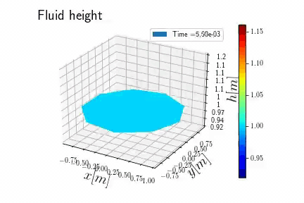

# Circular-Tank-PFEM-CDC-supplementary-material
Source codes and numerical results of our CDC paper "Port-Hamiltonian modeling, discretization and feedback control of a circular water tank"

## Simulation results for the 1D approximation

## Simulation results for the 2D model

