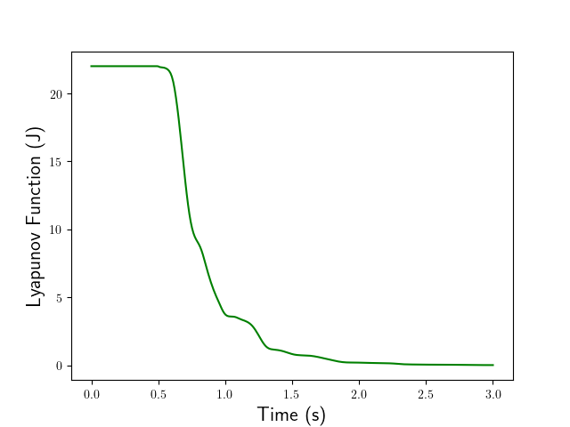

# Supplementary material for "Port-Hamiltonian modeling, discretization and feedback control of a circular water tank"
Authors: F.L. Cardoso-Ribeiro, A. Brugnoli, D. Matignon, L. Lefèvre.

This archive presents the source codes and numerical results of our paper "Port-Hamiltonian modeling, discretization and feedback control of a circular water tank", presented at the 2019 IEEE 58th Conference on Decision and Control (CDC), in Lyon, France.

The paper is available [here](https://ieeexplore.ieee.org/document/9030007).

The following codes are provided:

* `codes/Saint_Venant1D.py`: reduced model of the circular tank, considering radial symmetry (Figures 1 and 2 of the paper)

* `codes/Saint_Venant2D.py`: nonlinear 2D model with feedback control (Figures 3 and 4 of the paper)

* `codes/AnimateSurf.py`: auxiliary file used to obtain the animation


## Simulation results for the nonlinear 2D model with feedback control

The following animation shows the simulation results for the 2D controlled model (section V. B). 


The evolution of the Lyapunov function is presented below:



## How to install and run the code?

The numerical FEM model is obtained thanks to [FEniCS](https://fenicsproject.org/). Firstly, you need to install it. We suggest installing it from Anaconda, as described [here](https://fenicsproject.org/download/) (check the part FEniCS on Anaconda).

Once installed, you need to activate the FEniCs environment:

```console
your@user:~$ conda activate fenicsproject
```

Then, you just need to run the Python script on the environment:
```console
(fenicsproject) your@user:~$ python Saint_Venant2D.py
```

 The scripts were tested using Python 3.7, and FEniCS 2018.1.0.